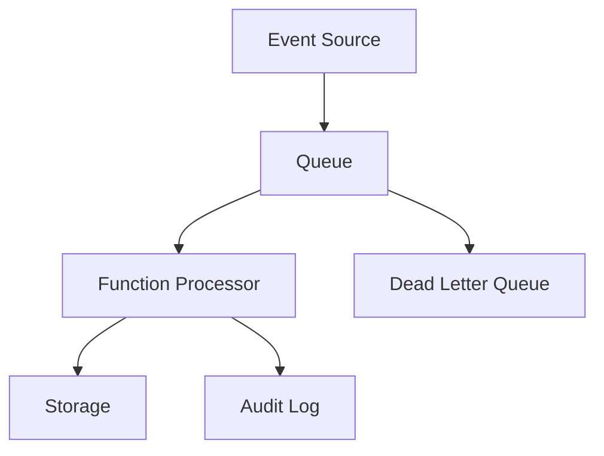

# Event-Driven Serverless Platform

A serverless architecture project that models event ingestion, queue-based decoupling, function processing, audit output, and dead-letter handling.

## Problem

Synchronous systems are brittle when workloads spike or downstream services slow down. This project shows a low-cost event-driven pattern where work is accepted quickly, buffered safely, processed asynchronously, and tracked with operational evidence.

## Architecture



## What This Proves

- Serverless and event-driven architecture design.
- Queue-based decoupling and retry thinking.
- Function handler implementation.
- Audit and dead-letter workflow awareness.
- Near-zero idle cost model.

## Repository Structure

| Path | Purpose |
| --- | --- |
| `terraform/` | Event-flow outputs and infrastructure model. |
| `src/` | Serverless handler code. |
| `docs/evidence/` | Validation summary and proof notes. |

## Validation

```powershell
powershell -ExecutionPolicy Bypass -File scripts/validate.ps1
```

## Cost Control

The project is designed around pay-per-use services with no idle compute. Live validation should use a small test event, capture output, then remove temporary resources.

## Interview Talking Points

- Why queues protect systems under burst traffic.
- How dead-letter queues support reliability.
- How audit logs help debugging and compliance.
- Why serverless can be strong for low-volume event workflows.
