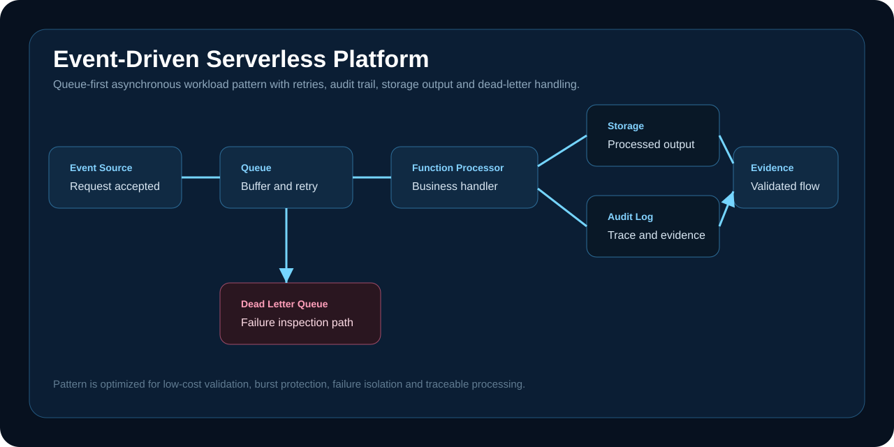

# Event-Driven Serverless Platform

A serverless architecture project that models event ingestion, queue-based decoupling, function processing, audit output, storage output and dead-letter handling.



## Executive Summary

This project demonstrates how to design an asynchronous workload path that accepts work quickly, buffers safely, retries predictably, records audit evidence and isolates failures for later inspection.

## Problem

Synchronous systems become fragile when workloads spike or downstream services slow down. A queue-first event model protects the user-facing path and gives operators better control over retry, failure inspection and evidence.

## Engineering Scope

| Area | Implementation |
| --- | --- |
| Event ingestion | Source-to-queue workload pattern |
| Decoupling | Queue boundary for burst handling and retry |
| Processing | Function handler implementation in `src/handler.js` |
| Reliability | Dead-letter path and failure-handling runbook |
| Evidence | Validation summary, local validation log and audit-output thinking |
| Cost control | Lightweight serverless model with no always-on compute |

## Repository Structure

| Path | Purpose |
| --- | --- |
| `terraform/` | Event-flow outputs and infrastructure model |
| `src/` | Serverless handler code |
| `scripts/validate.ps1` | Validation checks |
| `docs/evidence/` | Validation summary and proof notes |
| `docs/runbooks/` | Failure-handling procedure |
| `assets/` | Architecture visual used in the README |

## Validation

```powershell
powershell -ExecutionPolicy Bypass -File scripts/validate.ps1
```

## Production Expansion Path

- Add alarms for queue age, dead-letter depth and function error rate.
- Add idempotency keys for safe reprocessing.
- Add structured audit events with correlation IDs.
- Add deployment stages for dev, test and production.
- Add replay controls for failed events.

## Interview Defense

The project is about reliability shape, not just a function. The important decisions are queue-first ingestion, failure isolation, auditability, retry behavior and cost control. Those are the pieces that make event-driven systems operable.

## Status

Validated as a cost-controlled serverless design with reusable handler, infrastructure model, runbook and evidence artifacts.