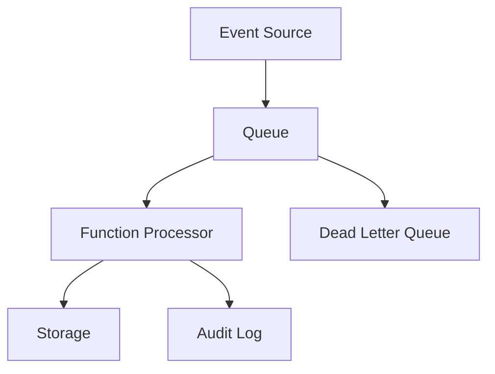

# Architecture

## Design Notes

The platform decouples ingestion from processing. Events can be accepted quickly, retried safely, and inspected later through audit logs or dead-letter handling.

## Production Extension

A production version would add schema validation, idempotency keys, replay tooling, alerting on dead-letter volume, tracing, and least-privilege identity for each component.
